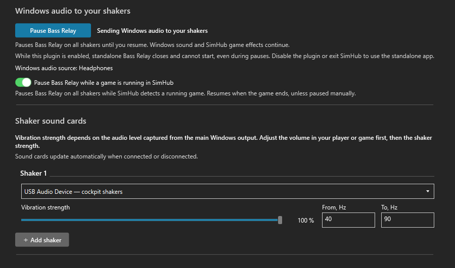

# Bass Relay

**Movies and music — feel the bass through your cockpit.**

Bass Relay brings movies and music to the bass shakers in your cockpit. It sends low frequencies from Windows audio to your shaker sound cards, so you can feel the bass through your seat. Choose a sound card, set the strength, and adjust the frequency range to suit your setup.

**Switch from movies or music to racing without manually pausing Bass Relay.** When SimHub reports that a game is running, Bass Relay automatically pauses all its shaker outputs and leaves the effects to SimHub. It stays paused between effects, including quiet stretches of road. When that status ends, bass output resumes unless you have paused manually. Automatic pause is enabled by default and can be turned off.

## Choose how to use it

| | Standalone app | SimHub plugin |
| --- | --- | --- |
| Controls | A small window and tray menu | A page inside SimHub |
| Movies and music | Works with or without SimHub | SimHub must stay open |
| Automatic game pause | Uses SimHub's local web server | Reads the game status directly from SimHub |
| Download | [Windows app 1.4.1](https://github.com/Lord-of-the-Bots/BassRelay/releases/tag/v1.4.1) | [SimHub plugin 0.3.0 preview](https://github.com/Lord-of-the-Bots/BassRelay/releases/tag/simhub-v0.3.0-preview) |

Both editions send bass from the current Windows output to your shaker sound cards. Choose the plugin if you prefer to keep everything in SimHub, or the standalone app if you want movies and music without running SimHub.

## Inside SimHub

The plugin has native SimHub controls for each sound card, vibration strength, frequency range, manual pause and automatic game pause. Devices refresh automatically. The interface follows SimHub's theme and language, with English, German, French, Italian, Korean, Russian and Simplified Chinese included. No separate Bass Relay process or SimHub web server is needed.



1. Download **BassRelay-SimHub-0.3.0-preview.zip** from the [plugin release](https://github.com/Lord-of-the-Bots/BassRelay/releases/tag/simhub-v0.3.0-preview).
2. Close SimHub and copy **BassRelay.SimHub.dll** and **BassRelay.Audio.dll** beside **SimHubWPF.exe** in your SimHub folder.
3. Start SimHub, enable **Bass Relay** in **Additional plugins**, and select your shaker sound cards on its page.

**The enabled plugin takes priority over the standalone app.** It closes a running standalone Bass Relay through its normal exit command and prevents it from starting again while the plugin is enabled, including during manual and automatic pauses. Disable the plugin or close SimHub to use the standalone app again. This works with standalone 1.4.1 without updating it. The standalone app's settings and Windows startup preference are preserved; its settings are separate from the plugin's.

The plugin is currently a preview for the Windows .NET Framework version of SimHub. See the [plugin guide](BassRelay.SimHub/README.md) for installation, compatibility and updates.

## Standalone app


1. Download and run **BassRelay-Setup-1.4.1.exe** from the [standalone release](https://github.com/Lord-of-the-Bots/BassRelay/releases/tag/v1.4.1). No administrator rights or separate .NET installation needed.
2. Choose the sound card connected to your shaker amplifier.
3. Adjust vibration strength. The default frequency range is **40–90 Hz**.

Use **+ Add shaker** for more sound cards, each with its own strength and frequency range. Closing the window keeps the app in the tray. Startup with Windows and closing to the tray can both be disabled in Settings.

Prefer no installer? Download the portable ZIP, extract it to a permanent writable folder, and run **BassRelay.exe**. Keep the included third-party notices with your copy. Settings are saved in `Data` beside the executable.

## Made for a cockpit that does more than racing

- Bass from the current Windows default audio output, including ordinary stereo films. No separate LFE track required.
- Automatically follows changes to the Windows default output.
- Separate strength and low/high frequency limits for each shaker sound card.
- Manual **Pause / Resume**; the button shows the action currently available.
- SimHub auto-pause enabled by default, with an option to turn it off.
- Windows 10/11. The standalone app is x64 and works without SimHub for films and music.

Frequency limits are **0–200 Hz**; the lower limit must be below the upper limit. A lower limit of 0 disables the high-pass filter. **20–80 Hz** is a useful starting range to experiment with; the right setting depends on your shaker and mounting.

Vibration strength depends on the audio level captured from the main Windows output. Adjust the volume in your player or game first, then set the shaker strength. The main Windows device volume slider may not change the level captured by Bass Relay.

The standalone interface is available in English, Russian, Brazilian Portuguese and Spanish; it uses the Windows interface language initially. The plugin follows SimHub's language instead.

## How the SimHub handover works

Bass Relay reads SimHub's local `GameRunning` status. It pauses **all its shaker outputs** while that status is true, including quiet stretches between game effects. It resumes when the status becomes false, unless you have paused manually.

The **plugin** reads the status directly from SimHub. The **standalone app** needs SimHub's local web server enabled, normally on port **8888**; no plugin is required. If you use another port with the standalone app, close it and update `SimHubPort` in `Data/settings.json`.

For some games, the status becomes active only when entering the track and ends in menus. Starting SimHub alone does not trigger the pause. Other applications and a game's built-in LFE output do not trigger it independently of SimHub.

For the standalone app, if SimHub is unavailable at startup, normal audio continues. If the connection drops during auto-pause, it holds the last active status for about five seconds before resuming. The plugin waits for SimHub's game status if it is unavailable and automatic pause is enabled. Use manual Pause when you need Bass Relay to stay silent until you resume it.

## Build

Requires Windows and the **.NET 10 SDK**.

```powershell
.\BassRelay\build.ps1
```

Creates a self-contained executable in `output/BassRelay`.

```powershell
.\BassRelay\build-installer.ps1 -CompilerPath "C:\Path\To\Inno Setup 6\ISCC.exe"
```

The installer uses Inno Setup 6. To build the plugin, also provide your SimHub installation folder:

```powershell
.\BassRelay.SimHub\build-plugin.ps1 -SimHubDirectory 'C:\Program Files (x86)\SimHub'
```

This produces the plugin ZIP in `output`. SimHub's assemblies are used for compilation and are not redistributed. Audio is implemented with NAudio 2.2.1 and WASAPI loopback. Dependency notices are in [THIRD-PARTY-NOTICES.txt](BassRelay/THIRD-PARTY-NOTICES.txt) and [Licenses](BassRelay/Licenses).

## Feedback

If something isn't working, [open an issue](https://github.com/Lord-of-the-Bots/BassRelay/issues). Include your sound cards, Windows version, and a description of what happens.


## Contact

For more information about our projects, visit our website: [https://nswtl.info](https://nswtl.info)

## Support Bass Relay

If Bass Relay adds something to your setup, you can support its development with a crypto donation:

BTC (Bitcoin):
1NbtPNkofnKZRjLpULRjhKuAtbh12DovC9

USDT, TRX (TRC20):
TUgM6hPokF1vPUW8CRp77CgvF3YroabwFP

TON:
UQBLdOWJeVeVg4b0-HkQGNVV8HG6-xWS7moZOUfNBz2-Jf3u

ETH (ERC20):
0x14bba7b8b76ea4743a202bdee2144e4d558ddf93

LTC (Litecoin):
LRRS5YBeqfkYpw2jC2bDAWgpcgm7Wpu6pM
