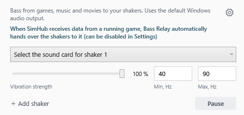

# Bass Relay

**Movies and music — feel the bass through your cockpit.**

Bass Relay brings movies and music to the bass shakers in your cockpit. It sends low frequencies from Windows audio to your shaker sound cards, so you can feel the bass through your seat. Choose a sound card, set the strength, and adjust the frequency range to suit your setup.

**Switch from movies or music to racing without manually pausing Bass Relay.** When SimHub reports that a game is running, Bass Relay automatically pauses all its shaker outputs and leaves the effects to SimHub. It stays paused between effects, including quiet stretches of road. When that status ends, bass output resumes unless you have paused manually. Automatic pause is enabled by default and can be turned off in Settings.

[**Download for Windows**](https://github.com/Lord-of-the-Bots/BassRelay/releases/latest)



## Getting started

1. Download and run **BassRelay-Setup-1.4.1.exe** from [Releases](https://github.com/Lord-of-the-Bots/BassRelay/releases/latest). No administrator rights or separate .NET installation needed.
2. Choose the sound card connected to your shaker amplifier.
3. Adjust vibration strength. The default frequency range is **40–90 Hz**.

Use **+ Add shaker** for more sound cards, each with its own strength and frequency range. Closing the window keeps the app in the tray. Startup with Windows and closing to the tray can both be disabled in Settings.

Prefer no installer? Download the portable ZIP, extract it to a permanent writable folder, and run **BassRelay.exe**. Keep the included third-party notices with your copy. Settings are saved in `Data` beside the executable.

## Made for a cockpit that does more than racing

- Bass from the current Windows default audio output, including ordinary stereo films. No separate LFE track required.
- Automatically follows changes to the Windows default output.
- Separate strength and low/high frequency limits for each shaker sound card.
- Manual **Pause / Resume**, in the window and the tray menu; the button shows the action currently available.
- SimHub auto-pause enabled by default, with an opt-out in Settings.
- English, Russian, Brazilian Portuguese and Spanish; uses the Windows interface language initially.
- Windows 10/11 x64. Works without SimHub for films and music.

Frequency limits are **0–200 Hz**; the lower limit must be below the upper limit. A lower limit of 0 disables the high-pass filter. **20–80 Hz** is a useful starting range to experiment with; the right setting depends on your shaker and mounting.

## How the SimHub handover works

Bass Relay reads SimHub's local `GameRunning` status. It pauses **all its shaker outputs** while that status is true, including quiet stretches between game effects. It resumes when the status becomes false, unless you have paused manually.

SimHub's local web server must be enabled, normally on port **8888**. No SimHub plugin is required. If you use another port, close Bass Relay and update `SimHubPort` in `Data/settings.json`.

For some games, the status becomes active only when entering the track and ends in menus. Starting SimHub alone does not trigger the pause. Other applications and a game's built-in LFE output do not trigger it independently of SimHub.

If SimHub is unavailable at startup, normal audio continues. If the connection drops during auto-pause, Bass Relay holds the last active status for about five seconds before resuming. Use manual Pause when you need it to stay silent regardless of connection status.

## Build

Requires Windows and the **.NET 10 SDK**.

```powershell
.\BassRelay\build.ps1
```

Creates a self-contained executable in `output/BassRelay`.

```powershell
.\BassRelay\build-installer.ps1 -CompilerPath "C:\Path\To\Inno Setup 6\ISCC.exe"
```

The installer uses Inno Setup 6. Audio is implemented with NAudio 2.2.1 and WASAPI loopback. Dependency notices are in [THIRD-PARTY-NOTICES.txt](BassRelay/THIRD-PARTY-NOTICES.txt) and [Licenses](BassRelay/Licenses).

## Feedback

If something isn't working, [open an issue](https://github.com/Lord-of-the-Bots/BassRelay/issues). Include your sound cards, Windows version, and a description of what happens.


## Contact

For more information about our projects, visit our website: [https://nswtl.info](https://nswtl.info)

## Support Bass Relay

If Bass Relay adds something to your setup, you can support its development with a crypto donation:

BTC (Bitcoin):
1NbtPNkofnKZRjLpULRjhKuAtbh12DovC9

USDT, TRX (TRC20):
TUgM6hPokF1vPUW8CRp77CgvF3YroabwFP

TON:
UQBLdOWJeVeVg4b0-HkQGNVV8HG6-xWS7moZOUfNBz2-Jf3u

ETH (ERC20):
0x14bba7b8b76ea4743a202bdee2144e4d558ddf93

LTC (Litecoin):
LRRS5YBeqfkYpw2jC2bDAWgpcgm7Wpu6pM
